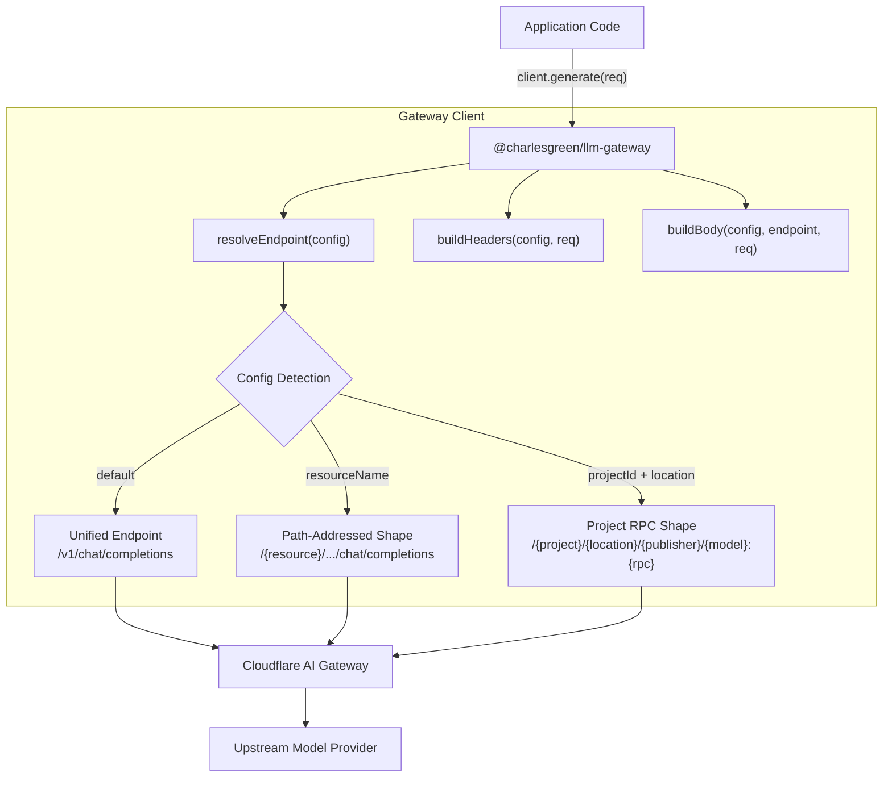

# @charlesgreen/llm-gateway

A small, dependency-free TypeScript client that carries model traffic through
Cloudflare AI Gateway.

It exists to make one guarantee: switching the underlying model provider is a config change in the
consuming app, never a code change. Nothing in this package compares against a provider name, so
when the provider changes there is nothing to edit, here or at the call site.

The rule that shapes the whole design, and the gate that enforces it, are in `AGENTS.md`.

## Architecture



## What it does

- Routes over three URL shapes, selected by config presence, never by comparing a provider name:
  a unified endpoint most providers reach; a path-addressed shape some require (`resourceName`);
  and a project-located rpc shape some require (`projectId` + `location`, with `publisher` and
  `rpc`). The project-located shape also switches the request envelope (contents / systemInstruction
  instead of messages) and the response parser.
- Composes two independent credentials: a gateway-hop token and an optional provider key. Both,
  either, or neither is valid. A deployment whose provider key is stored in the gateway sends no
  provider credential at all.
- Passes custom gateway headers (`headers`) directly through to the gateway hop, both at the client
  level and per-request. Useful for metadata logging (`cf-aig-metadata`) and cache controls
  (`cf-aig-cache-ttl`, `cf-aig-skip-cache`).
- Treats an unfilled `<placeholder>` as unset, and names the value to fix when a required one is
  missing.
- Redacts the configured model, provider, and resource strings out of upstream error bodies before
  throwing, because those messages get persisted and logged.
- Resolves config lazily, on the first call, so a bad variable never throws out of a handler ahead
  of its own setup and teardown.
- Ships a supported test kit on a subpath, so consumers do not hand-roll a drifting fake.

Deliberately absent: retries, caching, tiering, pricing, prompt templating, schema parsing,
streaming. Each is somebody else's job. This client stays a thin, provider-agnostic transport, and
adding any of them would bake in an opinion a consumer may not share.

## Install

The package is published to the public npm registry:

```sh
pnpm add @charlesgreen/llm-gateway
```

## Usage

### 1. Unified Endpoint (Default)

Most providers use the unified chat completions endpoint:

```ts
import { createGatewayClient } from "@charlesgreen/llm-gateway";

const client = createGatewayClient({
  accountId: env.AI_GATEWAY_ACCOUNT_ID,
  gatewayId: env.AI_GATEWAY_NAME,
  model: env.AI_MODEL,
  provider: env.LLM_PROVIDER,
  gatewayToken: env.AI_GATEWAY_TOKEN,

  // Model-family quirks are explicit config, never guessed from the model id:
  usesMaxCompletionTokens: env.AI_MODEL_USES_MAX_COMPLETION_TOKENS === "true",
  supportsTemperature: env.AI_MODEL_SUPPORTS_TEMPERATURE !== "false",
  maxOutputTokens: Number(env.AI_MAX_OUTPUT_TOKENS) || undefined,

  // Optional: make errors name your environment variables instead of config fields:
  varNames: { model: "AI_MODEL", provider: "LLM_PROVIDER" },
});

const { text, usage } = await client.generate({
  system: "You are a careful analyst.",
  user: documentText,
  temperature: 0.1,
});
// usage → { inputTokens, outputTokens }
```

### 2. Gateway Headers Passthrough

Pass Cloudflare AI Gateway metadata or cache controls via `headers` on the client or per-request.
Request-level headers override client-level headers with matching names:

```ts
const client = createGatewayClient({
  ...baseConfig,
  headers: {
    // Tag all requests from this client in the AI Gateway dashboard:
    "cf-aig-metadata": JSON.stringify({ environment: "production", service: "worker" }),
  },
});

// Per-request cache control and overrides:
const result = await client.generate({
  system: "Summarize this ticket.",
  user: ticketText,
  headers: {
    "cf-aig-cache-ttl": "3600",
    "cf-aig-metadata": JSON.stringify({ ticketId: "12345" }),
  },
});
```

### 3. Path-Addressed Provider

When a deployment requires resource and model information in the URL path, set `resourceName` and
`apiVersion`. The client omits the model field from the body and places the resource in the path:

```ts
const client = createGatewayClient({
  accountId: env.AI_GATEWAY_ACCOUNT_ID,
  gatewayId: env.AI_GATEWAY_NAME,
  provider: env.LLM_PROVIDER,
  model: env.AI_MODEL,

  // Presence of resourceName routes to the path-addressed shape:
  resourceName: env.AI_PROVIDER_RESOURCE,
  apiVersion: env.AI_PROVIDER_API_VERSION,
});
```

### 4. Project-Located RPC Provider

When a deployment targets a project-located RPC endpoint, set `projectId`, `location`, `publisher`,
and `rpc`. The client builds the RPC URL, formats the body as `contents` and `systemInstruction`, and
reads the response candidates:

```ts
const client = createGatewayClient({
  accountId: env.AI_GATEWAY_ACCOUNT_ID,
  gatewayId: env.AI_GATEWAY_NAME,
  provider: env.LLM_PROVIDER,
  model: env.AI_MODEL,

  // Setting projectId and location routes to the project-located RPC shape:
  projectId: env.AI_PROVIDER_PROJECT,
  location: env.AI_PROVIDER_LOCATION,
  publisher: env.AI_PROVIDER_PUBLISHER,
  rpc: env.AI_PROVIDER_RPC,
});
```

### 5. Authentication

The gateway token and provider key are independent:

```ts
// Scenario A: Stored in Gateway (zero credentials sent by client)
createGatewayClient({ ...base });

// Scenario B: Gateway token only (Authenticated Gateway)
createGatewayClient({ ...base, gatewayToken: env.AI_GATEWAY_TOKEN });

// Scenario C: Custom provider key header (bare key, no Bearer scheme)
createGatewayClient({
  ...base,
  providerKey: env.PROVIDER_KEY,
  providerAuth: { header: "api-key" },
});

// Scenario D: Both credentials composed
createGatewayClient({
  ...base,
  gatewayToken: env.AI_GATEWAY_TOKEN,
  providerKey: env.PROVIDER_KEY,
  providerAuth: { header: "X-Auth-Key", scheme: "Token" },
});
```

### 6. Testing

The testing subpath exports `fakeFetch` and `cassetteClient` to test callers without network calls:

```ts
import { fakeFetch, cassetteClient } from "@charlesgreen/llm-gateway/testing";

// Assert the exact URL, headers, and body the client constructs:
const fake = fakeFetch();
await createGatewayClient({ ...cfg, fetchImpl: fake.fetchImpl }).generate(req);

expect(fake.only().url).toBe(expectedUrl);
expect(fake.headers()["cf-aig-metadata"]).toBeDefined();

// Or return recorded responses directly in unit tests:
const client = cassetteClient("recorded response text");
const res = await client.generate(req);
expect(res.text).toBe("recorded response text");
```

## Contributing

`pnpm check` is the gate: lint, typecheck, tests with coverage, build, and the no-provider-literals
scan.

That last step is not a style rule. Consumers bundle this package's compiled output into a build
that is itself scanned for vendor brand tokens in identifiers, string literals, and comments. A
single brand token here turns a consumer's build red and keeps it red, so zero literals is a hard
interface requirement. Never weaken the scanner to make it pass; route the value through config
instead.

Releases publish on a `v*` tag, not on merge. See `.github/workflows/publish.yml` for the flow.
